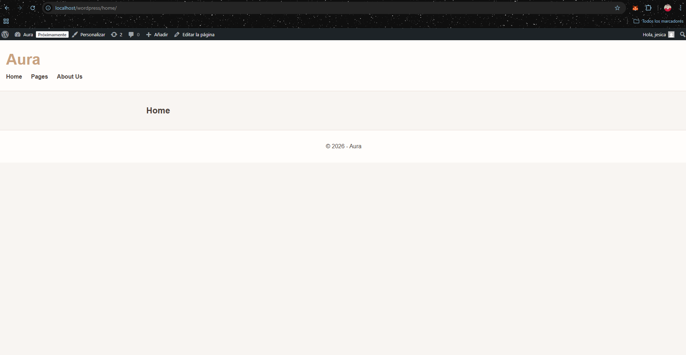
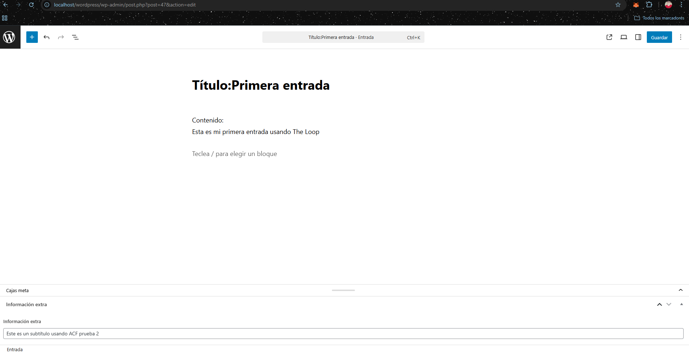
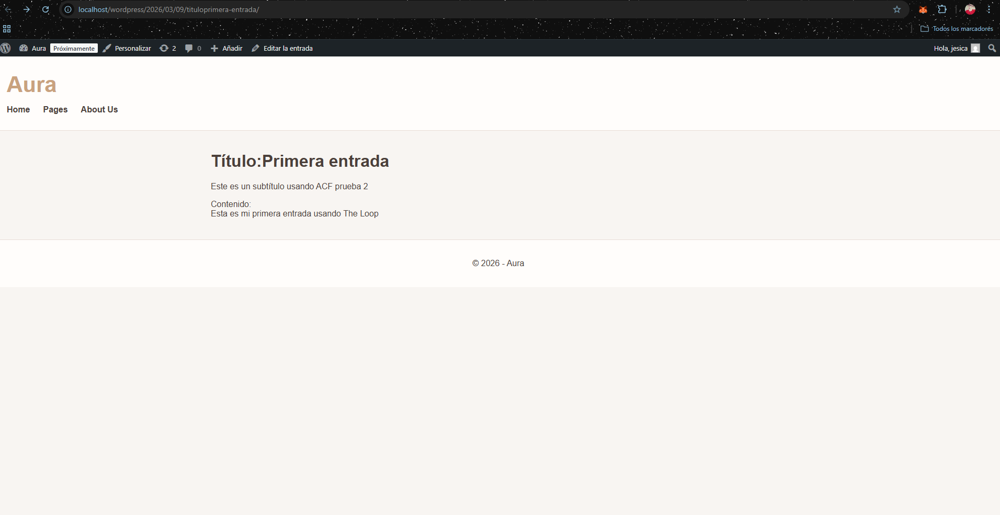
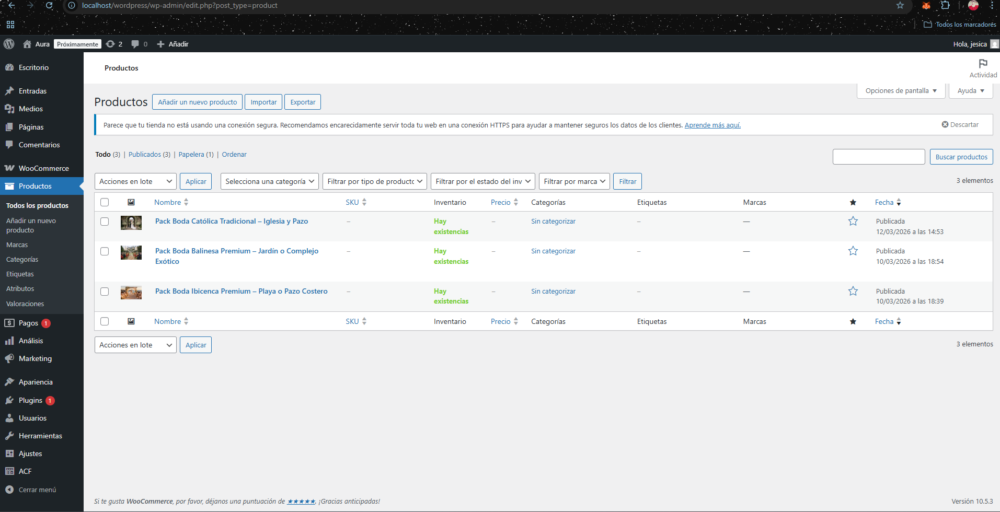
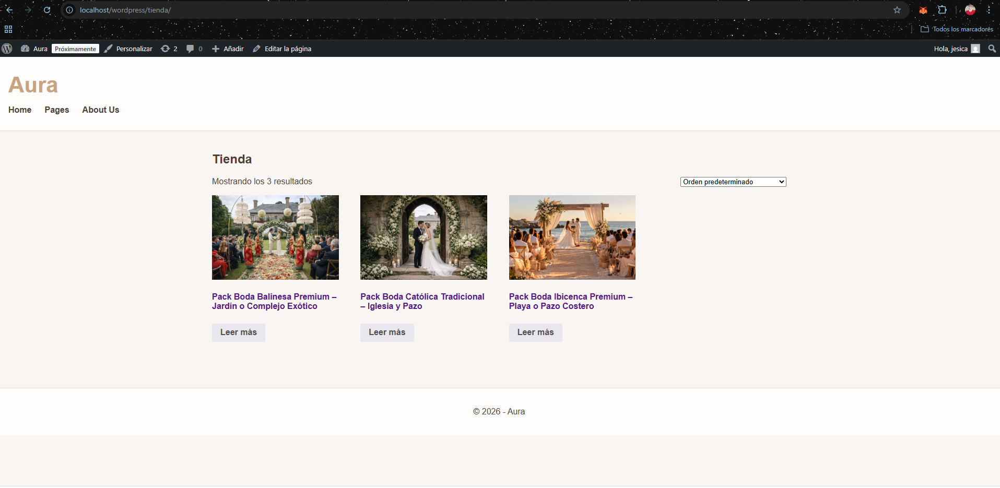
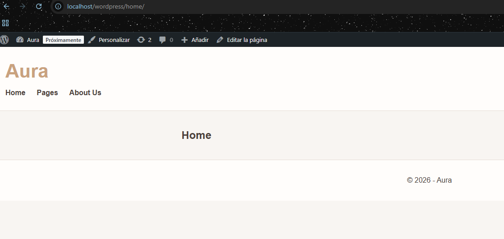

# CodeNode – Semana 3 WordPress

## Descripción

Durante el desarrollo surgieron algunos problemas en el entorno local al iniciar MySQL en XAMPP.

Apareció el error **“MySQL shutdown unexpectedly”** y un problema de acceso en phpMyAdmin **“Host 'localhost' is not allowed to connect”**.  
Tras revisar los logs se detectaron archivos de replicación corruptos y una configuración duplicada en la carpeta **data**.

El problema se solucionó eliminando esos archivos, renombrando la configuración conflictiva y restaurando temporalmente el acceso del usuario **root** mediante **skip-grant-tables**.

---

## Objetivos de la práctica

- Tener el **tema personalizado de WordPress funcionando en local**
- Crear **al menos un campo ACF** en entradas y mostrarlo en el tema
- Instalar **WooCommerce** y añadir **mínimo 3 productos**
- Añadir **soporte para menús de navegación** en el tema

---

## Reto opcional

Crear **single.php** para mostrar el detalle de una entrada utilizando:

- Campos nativos de WordPress (`the_title`, `the_content`)
- Campo personalizado **ACF**

---

## Mejoras realizadas

- Dar **estilo global a la web**
- Mejorar el **header y el menú**
- Dar **estilo al contenido de las entradas**
- Crear **3 productos en WooCommerce**

---

## Capturas de la práctica

### Tema funcionando en local

---

### Campo ACF mostrado en una entrada

---

### Plantilla single.php funcionando

---

### WooCommerce instalado

---

### Productos creados

---

### Menú de navegación funcionando

---

## Tecnologías utilizadas

- WordPress
- PHP
- WooCommerce
- Advanced Custom Fields (ACF)
- CSS
- XAMPP
